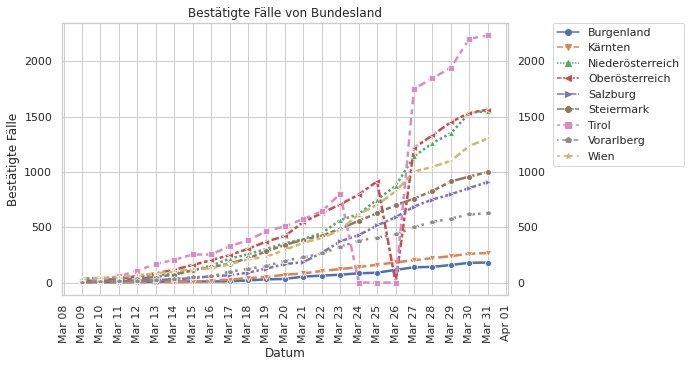

# 🇦🇹 Österreich Austria - COVID-19 Cases
 

Data concerning confirmed cases and recoveries of the novel coronavirus that causes COVID-19.

**Sources**:
  * The Bundesministerium für Soziales, Gesundheit, Pflege und Konsumentenschutz's [update page](https://www.sozialministerium.at/Informationen-zum-Coronavirus/Neuartiges-Coronavirus-(2019-nCov).html)
  * Historical data (before 2020-03-11) was filled in from archive.org's [historical snapshots of the above page](https://web.archive.org/web/*/https://www.sozialministerium.at/Informationen-zum-Coronavirus/Neuartiges-Coronavirus-(2019-nCov).html).


## Current Data



## Developer

#### Update the data sets

```console
pip install -r requirements.txt
python cases.py
```

## License

Code and notebooks Copyright 2020 Casey Link. Licensed under the AGPL v3 or later.

Github workflow Copyright 2020 [Alex](https://github.com/alext234). Licensed under Apache 2.0.

Inspired by https://github.com/alext234/coronavirus-stats
