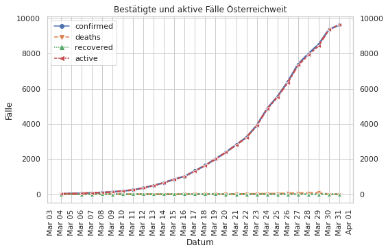
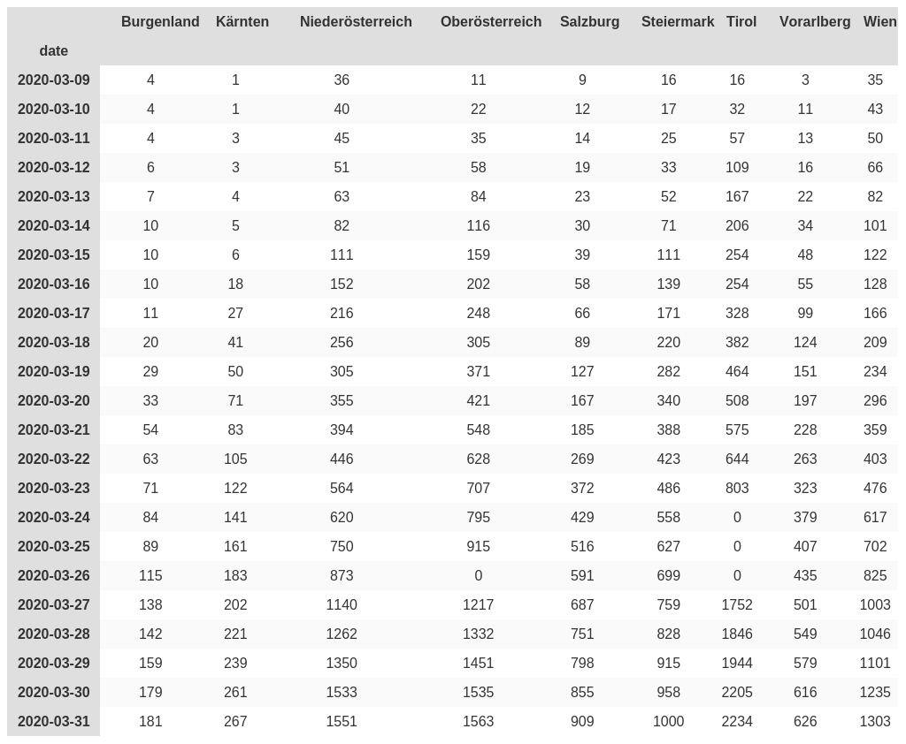

# 🇦🇹 Österreich Austria - COVID-19 Cases

[](https://github.com/Ramblurr/Austria-COVID-19/actions?query=workflow%3A%22Automatic+update%22)

Data concerning confirmed cases and recoveries of the novel coronavirus that causes COVID-19.

**Sources**:
  * The Bundesministerium für Soziales, Gesundheit, Pflege und Konsumentenschutz's [update page](https://www.sozialministerium.at/Informationen-zum-Coronavirus/Neuartiges-Coronavirus-(2019-nCov).html)
  * Historical data (before 2020-03-11) was filled in from archive.org's [historical snapshots of the above page](https://web.archive.org/web/*/https://www.sozialministerium.at/Informationen-zum-Coronavirus/Neuartiges-Coronavirus-(2019-nCov).html).


## Current Data

**Last updated at:** 

#### Data in CSV Format:

* [cases.csv](./data/cases.csv)
* [recovered.csv](./data/recovered.csv)

### Total Confirmed Cases


### Total Active Cases

- "active" cases are those which have not recovered or not died


### Total Confirmed Recoveries


### Total Deaths


### Total Tests


### Bestätigte und aktive Fälle Österreichweit

- "active" cases are those which have not recovered or not died



### Confirmed cases by Bundesland




#### Predicting increase in infections

- Assumes no significant change to mitigation measures 

[table1]: start
<pre>
Predictions for cases in austria:

Last data point used in prediction from 2020-03-13 00:00:00

Infections in  1 days:    548 (14 Mar 2020)
Infections in  2 days:    683 (15 Mar 2020)
Infections in  3 days:    839 (16 Mar 2020)
Infections in  4 days:   1017 (17 Mar 2020)
Infections in  5 days:   1218 (18 Mar 2020)
Infections in  6 days:   1445 (19 Mar 2020)
Infections in  7 days:   1698 (20 Mar 2020)
Infections in  8 days:   1979 (21 Mar 2020)
Infections in  9 days:   2289 (22 Mar 2020)
Infections in 10 days:   2629 (23 Mar 2020)
Infections in 11 days:   3001 (24 Mar 2020)
Infections in 12 days:   3407 (25 Mar 2020)
Infections in 13 days:   3846 (26 Mar 2020)
Infections in 14 days:   4322 (27 Mar 2020)
Infections in 15 days:   4834 (28 Mar 2020)
Infections in 16 days:   5385 (29 Mar 2020)
Infections in 17 days:   5975 (30 Mar 2020)
Infections in 18 days:   6606 (31 Mar 2020)
Infections in 19 days:   7279 (01 Apr 2020)
Infections in 20 days:   7996 (02 Apr 2020)
Infections in 21 days:   8757 (03 Apr 2020)
Infections in 22 days:   9564 (04 Apr 2020)
Infections in 23 days:  10418 (05 Apr 2020)
Infections in 24 days:  11321 (06 Apr 2020)
Infections in 25 days:  12274 (07 Apr 2020)
Infections in 26 days:  13277 (08 Apr 2020)
Infections in 27 days:  14333 (09 Apr 2020)
Infections in 28 days:  15441 (10 Apr 2020)
Infections in 29 days:  16605 (11 Apr 2020)

Fit parameters: p = 2.876 c = 0.408 t0= -2.031 a0= 26.038
</pre>
[table1]: end

##### fitting the curve


#### How long does it take for the number of infections to double?

- ORF reported on 2020-03-12 that doubling was at 2.5 days
- however the the recent [Lancet paper](https://www.thelancet.com/journals/lancet/article/PIIS0140-6736(20)30260-9/fulltext) reports 6.4 days after studiying data from China for Dec 31, 2019, to Jan 28, 2020,
- based on %20%3D%20%202n(t)), we find 
- the time for infections or deaths to double is thus given by 
- Assumes no significant change to mitigation measures 

**Notably** these findings reproduce the ORFs reporting that in Austria around 2020-03-12 doubling was happening every 2.5 days.

[table2]: start
<pre>
Predictions for infections doubling in austria:

at day 0 (04 Mar 2020), the time to double n is 2.5 days
at day 2 (06 Mar 2020), the time to double n is 2.0 days
at day 4 (08 Mar 2020), the time to double n is 2.1 days
at day 6 (10 Mar 2020), the time to double n is 2.5 days
at day 8 (12 Mar 2020), the time to double n is 2.9 days
at day 10 (14 Mar 2020), the time to double n is 3.4 days
at day 12 (16 Mar 2020), the time to double n is 3.9 days
at day 14 (18 Mar 2020), the time to double n is 4.4 days
at day 16 (20 Mar 2020), the time to double n is 5.0 days
at day 18 (22 Mar 2020), the time to double n is 5.5 days
at day 20 (24 Mar 2020), the time to double n is 6.0 days
at day 22 (26 Mar 2020), the time to double n is 6.6 days
at day 24 (28 Mar 2020), the time to double n is 7.1 days
at day 26 (30 Mar 2020), the time to double n is 7.7 days
at day 28 (01 Apr 2020), the time to double n is 8.2 days

</pre>
[table2]: end

## Developer

#### Setup your virtualenv

```console
virtualenv -p $(which python3) venv
source venv/bin/activate
```

#### Update the csvs

```console
pip install -r requirements.txt
python -m parsers.austria
```

#### Update the plots

```console
jupyter nbconvert --execute --inplace *.ipynb
```

## License
Licensed under BSD 3-Clause License

Copyright (c) 2020, Hans Fangohr
Copyright (c) 2020, Casey Link

Github workflow Copyright (c) 2020 [Alex](https://github.com/alext234). Licensed under Apache 2.0.

**Inspired by:**

Inspired by https://github.com/alext234/coronavirus-stats

